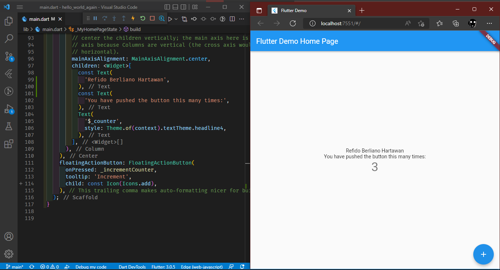
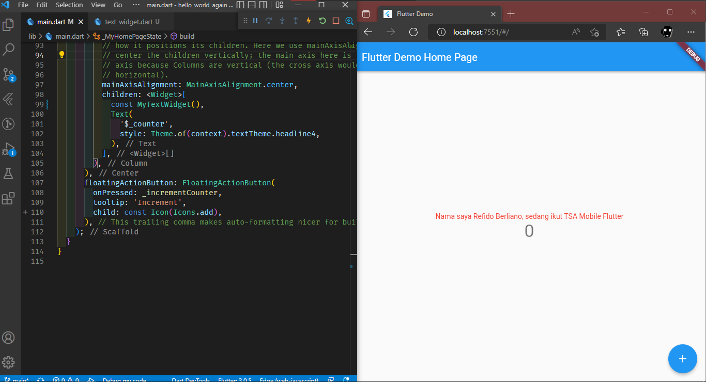
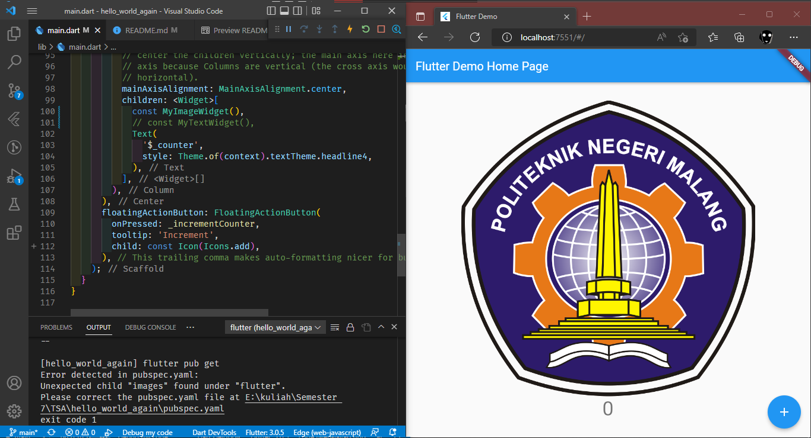
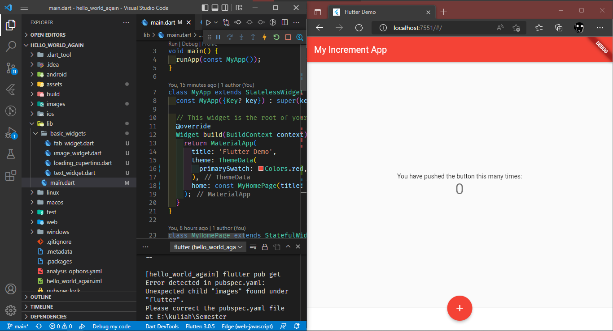
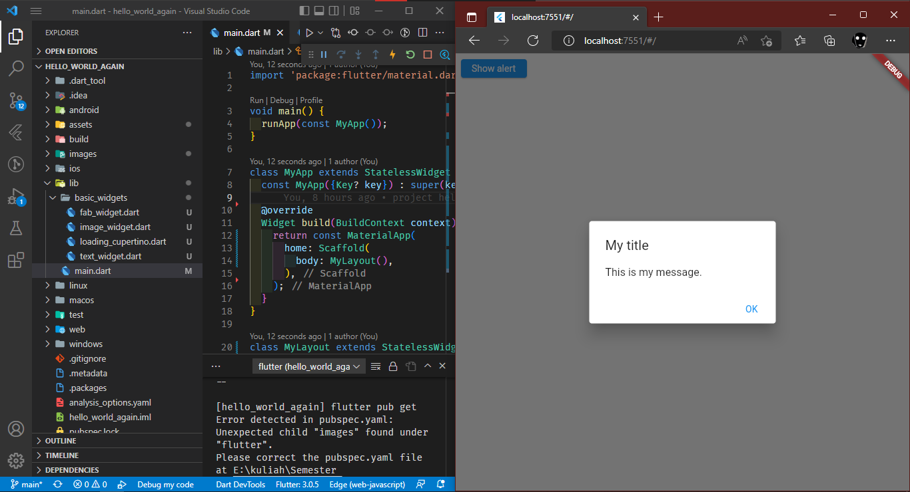
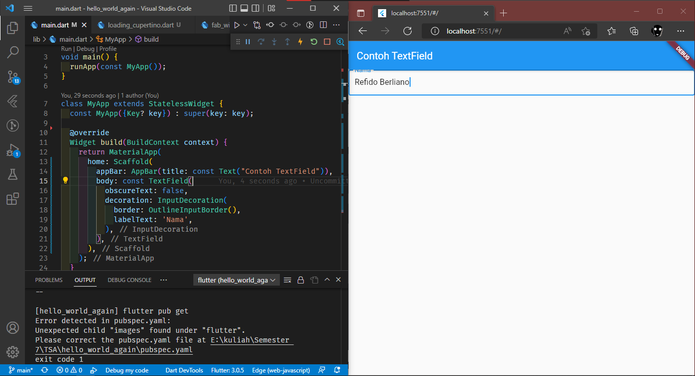
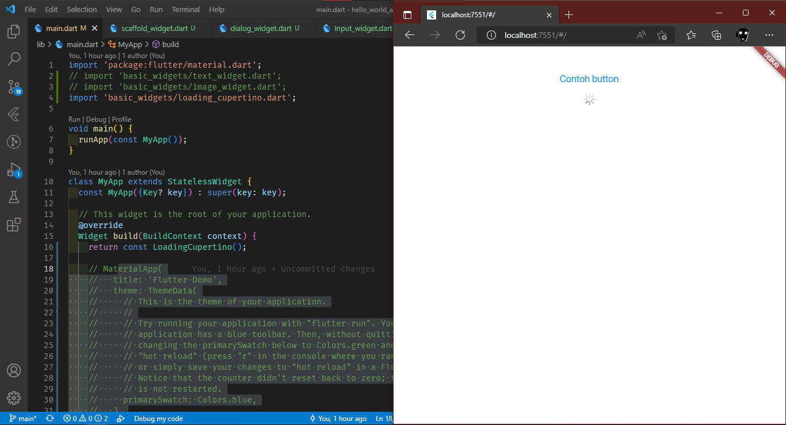
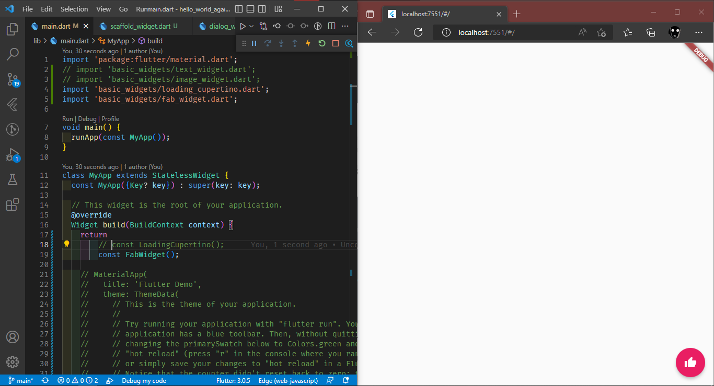
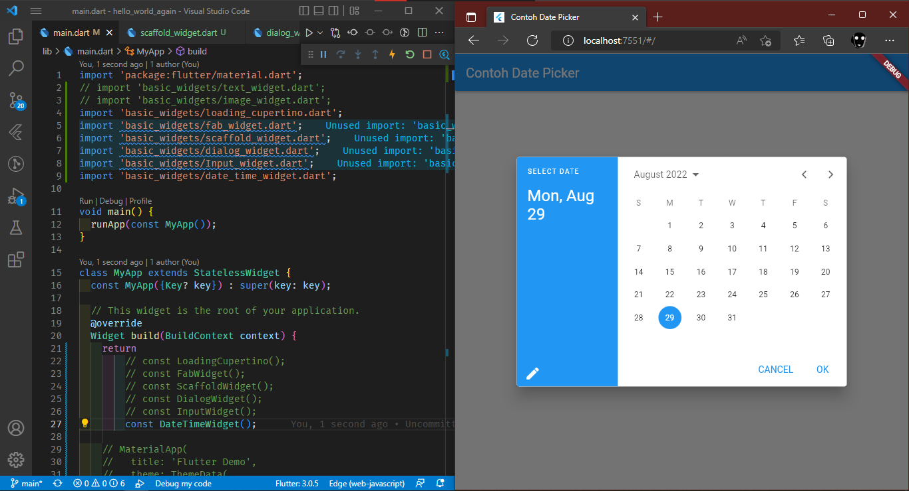

# hello_world_again
## Menambahkan nama lengkap

## Menambahkan Class Text Widget yang baru dibuat

## Menambahkan Class Image Widget yang baru dibuat

## Membuat Scaffold dan mengubah tema

## Membuat Popup atau alert dialog

## Membuat textfield

## Membuat button dan animasi loading

## Membuat floating button 

## Membuat date time picker
